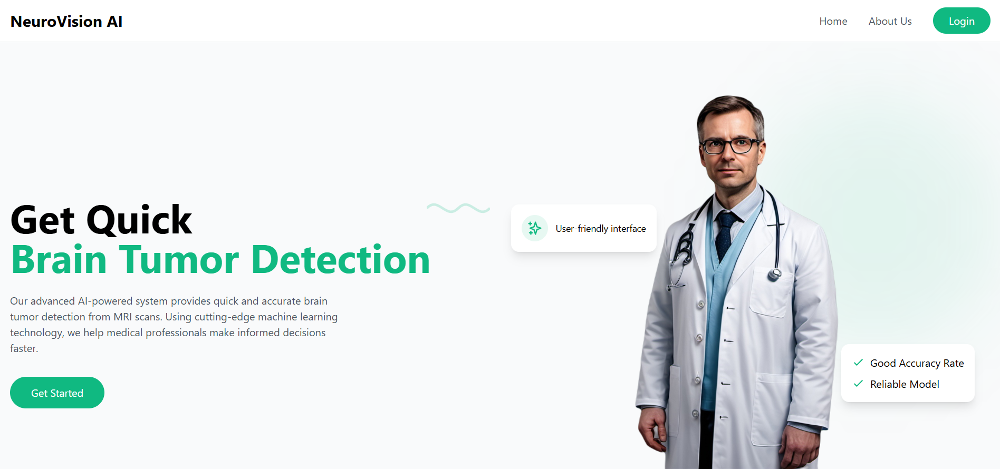
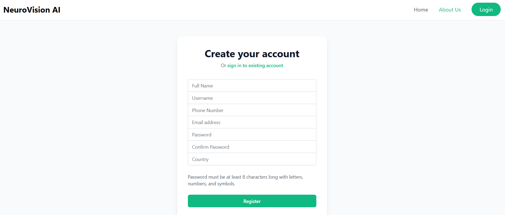

# 🧠 Brain Tumor Classification using CNN Framework

This project aims to detect and classify brain tumors from MRI images using advanced Convolutional Neural Network (CNN) architectures. It combines multiple pre-trained models and ensemble learning to enhance classification accuracy.

---

## 📌 Problem Statement

Manual detection of brain tumors through MRI images can be time-consuming and prone to human error. This project aims to build an automated, reliable, and accurate system to classify brain tumors into *tumorous* and *non-tumorous* categories using deep learning techniques.

---

## 🎯 Objectives

- Develop a deep learning framework to classify brain tumor MRI images.
- Train and evaluate multiple CNN models (VGG19, InceptionV3, DenseNet121, Xception, InceptionResNetV2).
- Use ensemble learning to improve accuracy and robustness.
- Apply preprocessing, data augmentation, and proper data splitting to ensure generalizability.

---

## 🧪 Dataset

- Total Images: **23,994**
- Classes: **Tumorous (11,999)** and **Non-tumorous (11,995)**
- Splits:
  - Train: 80% (≈19,195 images)
  - Validation: 10% (≈2,400 images)
  - Test: 10% (≈2,400 images)

---

## ⚙️ Preprocessing

The following image processing techniques were applied:
- Grayscale Conversion
- Gaussian Blurring
- Binary Thresholding
- Erosion and Dilation
- Contour Detection
- Cropping Region of Interest (ROI)

---

## 🔄 Data Augmentation

Implemented using Keras' `ImageDataGenerator`:
- Rotation (±40 degrees)
- Width/Height Shift (±20%)
- Shearing, Zooming
- Horizontal/Vertical Flip
- Brightness & Channel Shifting

---

## 🧠 Models Used

| Model               | Pretrained On | Feature Used   | Fine-tuned | Accuracy Achieved |
|--------------------|---------------|----------------|------------|-------------------|
| VGG19              | ImageNet      | Transfer + Custom Layers | ✅ | ✅ |
| Xception           | ImageNet      | Transfer + Custom Layers | ✅ | ✅ |
| InceptionResNetV2  | ImageNet      | Transfer + Custom Layers | ✅ | ✅ |
| DenseNet121        | ImageNet      | Transfer + Custom Layers | ✅ | ✅ |
| InceptionV3        | ImageNet      | Transfer + Custom Layers | ✅ | ✅ |

> Final model performance was evaluated using accuracy, loss graphs, and confusion matrix.

---

## 📦 Model Architecture

Each model follows this structure:
- Pretrained base (frozen initially)
- Flatten
- Batch Normalization
- Dense (256 neurons with ReLU)
- Dropout (0.5)
- Output: Dense(2, Softmax)

---

## 📁 Folder Structure

- app/ # Django or Streamlit App (Optional UI)
- models/ # Trained model weights (.keras files)
- dataset/ # Image dataset (not uploaded due to size)
- notebooks/ # Jupyter Notebooks for training & evaluation
- utils/ # Helper functions and preprocessing
- requirements.txt # Python dependencies
- README.md # Project documentation

---

## 📥 Way to access Models

> Due to the large file size, trained models are hosted on Google Drive:

📁 **[Download Models from Google Drive](https://drive.google.com/drive/folders/1WadpidHjSGjMDVxhiJixVe7djxRIPFHv?usp=drive_link)**  

---

## 📈 Performance Metrics

- **Loss Function:** Categorical Cross-Entropy  
- **Optimizer:** Adam  
  - Learning Rate: `1e-4` or `1e-5` depending on the model  
- **Evaluation Metrics:** Accuracy, Confusion Matrix, ROC AUC  

### ✅ Test Results

================ Model Performance Summary ================

- Model: VGG19
  - Test Accuracy   : 88.97%
  - Test Loss       : 0.2819

- Model: Xception
  - Test Accuracy   : 89.61%
  - Test Loss       : 0.2174

- Model: InceptionResNetV2
  - Test Accuracy   : 89.58%
  - Test Loss       : 0.2692

- Model: DenseNet121
  - Test Accuracy   : 93.88%
  - Test Loss       : 0.1867

- Model: InceptionV3
  - Test Accuracy   : 89.64%
  - Test Loss       : 0.2136

===========================================================

---

## 🖼️ User Interface

Here is a sample screenshot of the application's front-end interface:

